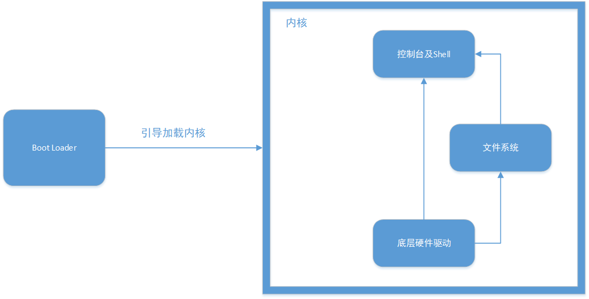

# SimpleOS
***
一个简单操作系统的实现

## 实现功能

* boot loader引导程序
* 内核程序
* 文件系统
* 控制台shell

## 系统结构



* Boot Loader:引导程序，用于完成系统的一些初始化工作并从磁盘中将内核程序加载至内存中执行
* 底层硬件驱动：本操作系统中仅实现**键盘**，**显示**，**磁盘**三个硬件所需的驱动，完成读取用户输入，显示信息及读写磁盘三个功能
* 文件系统：本操作系统实现了一个简单的文件系统，通过对读写磁盘操作的封装，实现了一系列基本功能，并再将这些功能封装成shell指令暴露给shell使用
* 控制台及shell：通过键盘驱动读取用户输入并显示在屏幕上，解析并执行用户命令

## Boot Loader

* 设置段描述符表，开启保护模式
* 找到内核程序并载入内存
* 创建页表，页表直接为虚拟地址到物理地址的一一映射，使用4Mb扩展页表，启用分页机制
* 跳转至内核入口地址，结束引导

## 底层硬件驱动

### 显示

* 将待显示的字符串载入显存中完成最基本的显示功能，并移动光标
* 支持打印十六进制的数字
* 允许回退

## 键盘

* 使用中断处理程序来控制
* 当需要从键盘获取数据时，启用键盘中断
* 在中断处理程序内获取数据，当用户松开按键时，将按键显示在屏幕上，并存入缓存区
* 支持组合键SHIFT组合键，支持部分CTRL组合键，支持识别以E0开头的扫描码按键
* 提供getline，getchar，分别提供读取整行数据，读取单个字符的功能

## 磁盘

* 实现对读写操作
* 通过IO端口对磁盘进行操作
* 读取数据时，先向硬盘发送读取请求
* 硬盘处理完毕后，发出一个中断请求，从中读取获取的数据
* 保存数据时，先向硬盘发生保存请求，再写入待保存的数据
* 待硬盘处理完毕后，发出中断请求，确认数据已保存

## 文件系统

### 特点

- 支持绝对路径和相对路径
- 大部分指令与Linux文件指令命名一致
- 使用大文件模拟硬盘，编写驱动api模拟与硬盘的交互
- 可通过修改驱动api移植到不同平台

### 支持操作

#### 格式化

- 指令格式```mkfs```
- 作用：将文件系统格式化

#### 创建目录

- 指令格式```mkdir dir1Name1 dirName2...```
- 作用：根据输入参数创建目录

#### 显示目录

- 指令格式```ls dir1Name1 dirName2...```
- 作用：根据输入参数显示目录下的所有文件和子目录，若无输入参数，则显示当前目录下的文件与子目录

#### 显示当前目录

- 指令格式```pwd```
- 作用：显示当前用户所处的目录

#### 更改当前路径

- 指令格式```cd dirName```
- 作用：移动到dirName目录下，若无输入参数，移动到根目录下

#### 删除文件或目录

- 指令格式```rm name1 name2...```
- 作用：删除输入参数所示的文件或目录，删除目录时则会删除该目录下的所有目录或文件

#### 创建文件

- 指令格式```mkfl fileName1 fileName2...```
- 作用：根据输入参数创建文件

#### 写文件

- 指令格式```wrfl filename```
- 作用：执行指令后，用户输入文件内容，以EOF（CTRL+c）作为结束标志

#### 读文件

- 指令格式```cat fileName1 fileName2...```
- 作用：显示出输入参数所指向的文件的内容

#### 打开文件/关闭文件

- 以系统调用的形式存在，不直接作为指令提供给用户

#### 文件系统结构

- 文件系统由位图扇区和文件扇区构成

- 每个扇区大小为512b

- 文件采用链接式存储

- 每个文件扇区由以下三个部分构成

  > 文件头FILE_HEADER
  >
  > 文件名字
  >
  > 文件内容

- 文件头FILE_HEADER格式

  > typedef struct File_Header{
  >
  > int type;
  > 	
  > int father_id;
  >
  > int now_id;
  >
  > int last_id;
  >
  > int next_id;
  >
  > int name_len;
  >
  > int used_size;
  >
  > }FILE_HEADER;

  - type:文件类型
  - father_id:所在目录的起始扇区编号
  - now_id:当前文件扇区的编号
  - last_id:上一个文件扇区编号
  - next_id:下一个文件扇区编号
  - name_len:文件名长度
  - used_size:当前扇区已使用空间大小

## Shell及控制台

* 通过键盘驱动提供的API获取用户的输入
* 解析指令，获取指令名及参数
* 对照指令列表找到待执行的指令